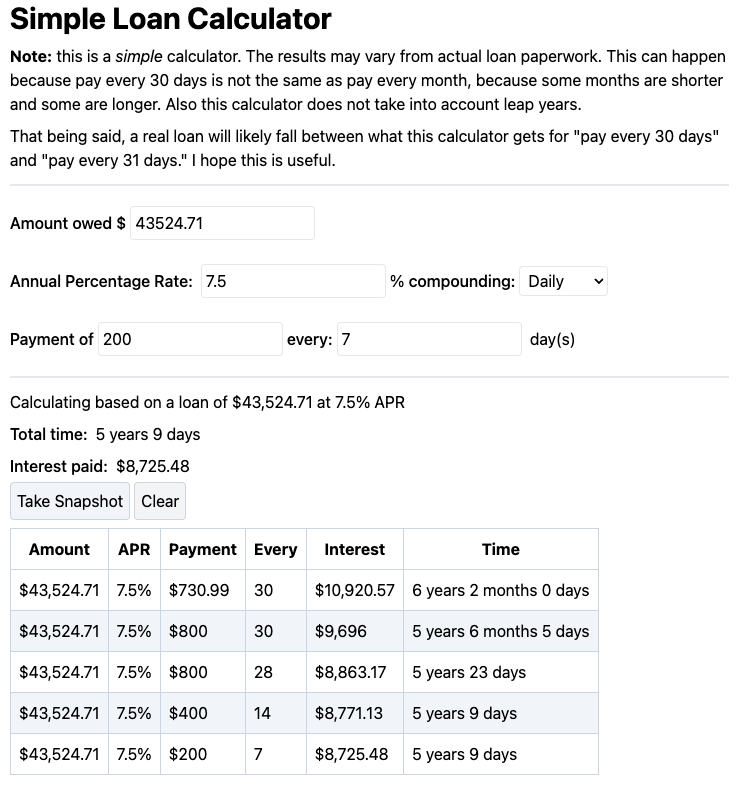

# Simple Loan Calculator

My first Rust Leptos app.

This is a simple loan payments calculator.

Designed to help you make decisions about load payments and how
interest plays into things.



## Building
As of Jan 28 2024, need to be on Rust nightly.

You can set just this project to be on nightly with:

``` 
rustup override set nightly
```

For easy of development, get `trunk`:
``` 
cargo install trunk
```

Then run a local server with:
```
trunk serve --address 0.0.0.0
```
The `0.0.0.0` is just there to make it easy to test with other local network devices like phones.

## Release Build
To build the release version run:
```
trunk build --release
```
The build will be in the `dist/` folder.

Oddly, the `dist/index.html` seems to be formatted oddly.
It is missing the beginning `<html>` tag and `<head>` tag...
Also it expects everything to be in the root folder
i.e. imports from `/simple-load...` rather than `./simple-loan...`

This is probably fine if deploying as the main thing,
but deploying into a subfolder on the server this causes problems.
So before uploading consider changing those imports in `index.html` to be relative.


